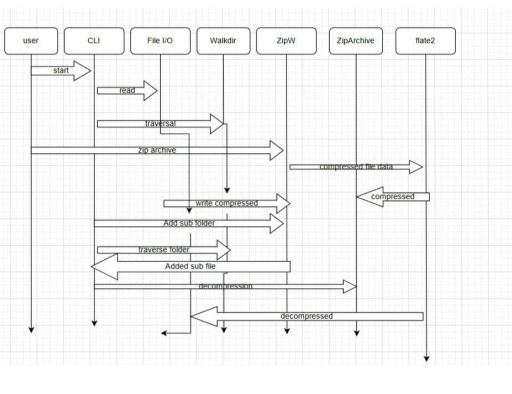

## ZIP COMPRESSION & DECOMPRESSION
* Build a CLI based Tool for zip compression/decompression in Rust programming language using DEFLATE Algorithm supporting recursive directory compression with file structure
* The project is command line zip utility built in rust that can compress single file , multiple files , compress entire folder, decompress a zip archive back to original files
* It reads file , compress their data using the DEFLATE stores them in ZIP format can later extract them back

## Building steps :
1.CLI interface
2.File reading
3.COmpression
4.ZIP Packing
5.Decompression

## Flow:

<p align="center">
  
</p>

user command -> CLI -> Compress/decompress ->Compression engine(DEFLATE) ->Zip writer/reader ->File System

## Packages:
-zip
-flate2
-clap

-zip : Library used to create ZIP files, read ZIP archives , Zip rules
-Manual : zip binary format is written 

## How does it work?
## 1. CLI Parse
The application starts in `main.rs`.
- CLI arguments are parsed using the `clap` library.
- Supports operations such as:
  - `compress`
  - `decompress`
- Accepts:
  - Input file / directory path
  - Output archive path
  - Optional flags
- `clap` automatically
  - Validates argument structure
  - Generates help messages
  - Handles incorrect usage errors
This ensures structured command-line interaction.
---
## 2. Input Validation
Before performing any operation:
- Checks whether the input is:
  - Valid file
  - Valid directory
- Verifies read and write permissions.
- Ensures the path exists.
- Handles errors using Rust’s ownership and error model:
  
```rust
Result<T, E>
---
## 3. Compression (Byte-Level)
Compression is performed at the byte level.
### Steps:
1. File is opened using `std::fs::File`.
2. File content is read into a byte buffer (`Vec<u8>`).
3. Manual ZIP writer is initialized.
4. File entry is started with metadata:
   - File name
   - File size
   - Timestamp
5. Compression is applied using:
   - `flate2` crate
   - DEFLATE algorithm
6. Compressed bytes are written into ZIP structure.

### Technical Flow:
Raw Bytes  
→ DEFLATE Compression  
→ ZIP Local Header  
→ Central Directory Entry  
This ensures proper ZIP format compliance.
---

## 4. Decompression
Decompression follows the ZIP archive structure.
### Steps:
1. ZIP archive is opened using the `zip` crate.
2. Central Directory (CD) is parsed.
3. File entries are iterated recursively.
4. For each file entry:
   - Compressed data is read.
   - Data is decoded using DEFLATE.
   - Original content is written back to disk.
5. Original directory structure is reconstructed.
---
## 5. Recursive Directory Traversal
### Initial Implementation:
- Used `walkdir` crate for automatic directory traversal.
### Current Implementation:
- Removed `walkdir` dependency.
- Implemented manual traversal using:
### Depth-First Search (DFS) Tree Method
- Uses stack-based recursion.
- Traverses:
  - Root directory
  - Subdirectories
  - Leaf files
- Maintains exact directory hierarchy inside the ZIP archive.
